### Tópicos
- Introducción
- Hipótesis
- Objetivo
- Métodos y materiales
- Resultados
- Resumen

### Cáncer

### Progresión del Cáncer

<a target="_blank" href="">[1]</a> Stephen B. Edge, et al. "The American Joint Committee on Cancer: the 7th Edition of the AJCC Cancer Staging Manual and the Future of TNM". Annals of Surgical Oncology 17. 6(2010): 1471–1474.

### Regulación genética y epigenética 

### Metilación

<a target="_blank" href="">[1]</a>Modificado de Michalak EM, Burr ML, Bannister AJ, Dawson MA. The roles of DNA, RNA and histone methylation in ageing and cancer. Nat Rev Mol Cell Biol. 2019;20(10):573-589.

### Metilación
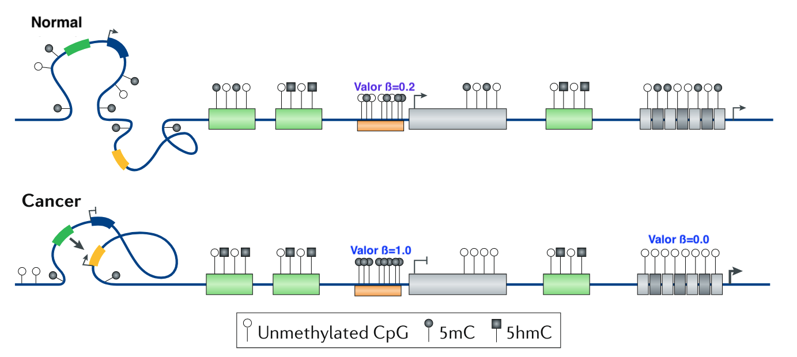

<a target="_blank" href="">[1]</a>Modificado de Michalak EM, Burr ML, Bannister AJ, Dawson MA. The roles of DNA, RNA and histone methylation in ageing and cancer. Nat Rev Mol Cell Biol. 2019;20(10):573-589.

### Fuentes de datos
- TCGA (The Cancer Genome Atlas)
	- 11,300 pacientes 
	- más de 30 tejidos de cáncer.
	- Secuenciación RNA
		- mRNA 
	- Secuenciación de 450K sitios CpG

<a target="_blank" href="">[1]</a>The Cancer Genome Atlas Research Network. "Before and After: Comparison of Legacy and Harmonized TCGA Genomic Data Commons Data". Cell Systems. 2019;9(1):24-34.e10.

<aside class="notes">
Que es un experimento RNAseq?
Que es un experimento de miRNAs?
Como se hace la secuención de sitios CpG?
</aside>

### Hipótesis
Existen **posibles mecanismos** de control regulatorio llevados a cabo por miRNAs y por metilación sobre genes involucrados en la progresión del cáncer.

### Objetivo
Encontrar **genes clave** que son afectados por **miRNAs** o por **metilación**, los cuales cambian su programa regulatorio y de **co-expresión** durante   la progresión del cáncer.

### Métodos y materiales

### Flujo de trabajo

### Carcinoma Renal
- Cáncer "silencioso" (ausencia de síntomas).
- 80% de los casos se diagnostican de manera incidental en imágenes solicitadas por otros motivos,
- de estos, el 20 % son diagnosticados en etapas avanzadas,
- la tasa de mortalidad es del 95% a los 5 años.

<a target="_blank" href="">[2]</a>James J. Hsieh, et al. "Renal cell carcinoma". Nature Reviews Disease Primers 3. 1(2017).

### CRcc - Características Moleculares
- 85% se encuentran en células claras.
- Línea principal:  Mutaciones en VHL.
- Pérdida en VHL no induce ccRC.
- Biomarcadores de metilación no especificados.
- Histopatalogía con alta degradación de MEC (regado de estroma)

<a target="_blank" href="">[2]</a>James J. Hsieh, et al. "Renal cell carcinoma". Nature Reviews Disease Primers 3. 1(2017).

### Muestras de ccRC
| Control | Etapa I  | Etapa II | Etapa III | Etapa IV |
|:-------:|:--------:|:--------:|:---------:|:--------:|
|  72     |  272     |   59     | 123       | 82       |

### Metiloma
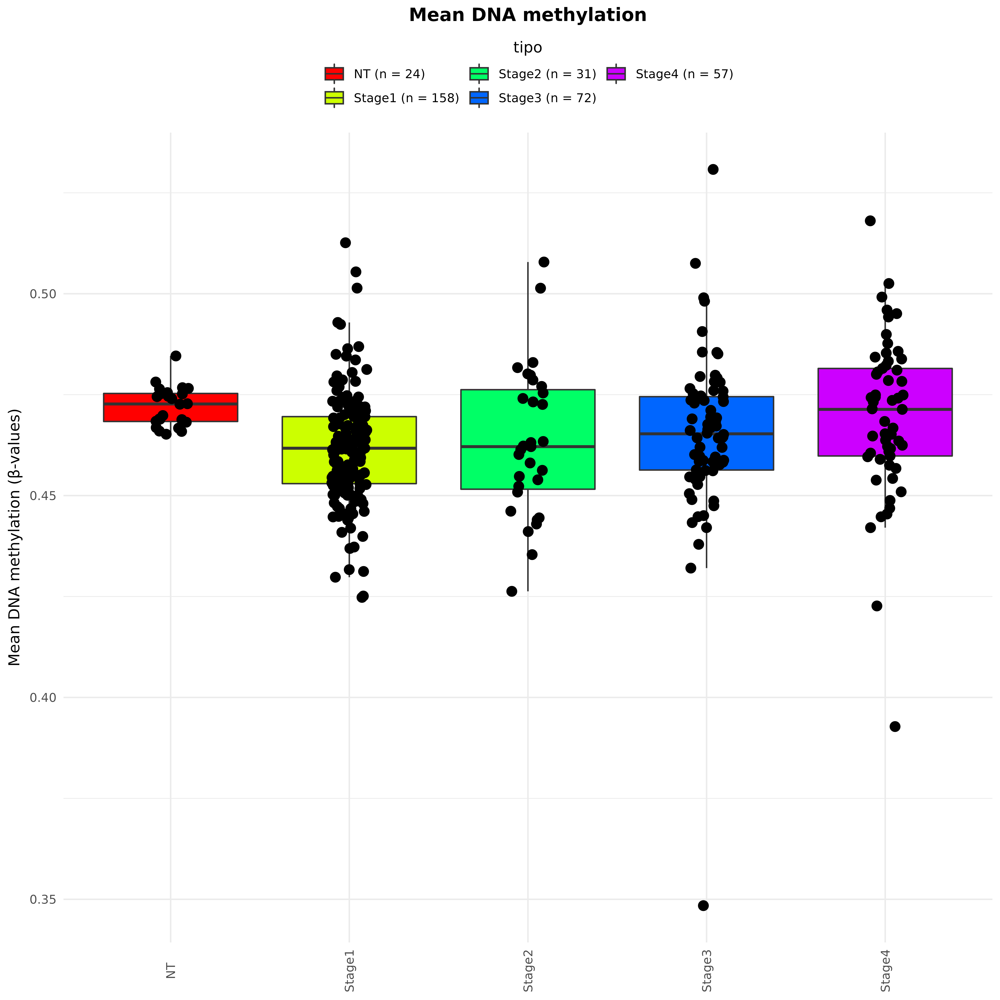

### Agrupamiento del metiloma
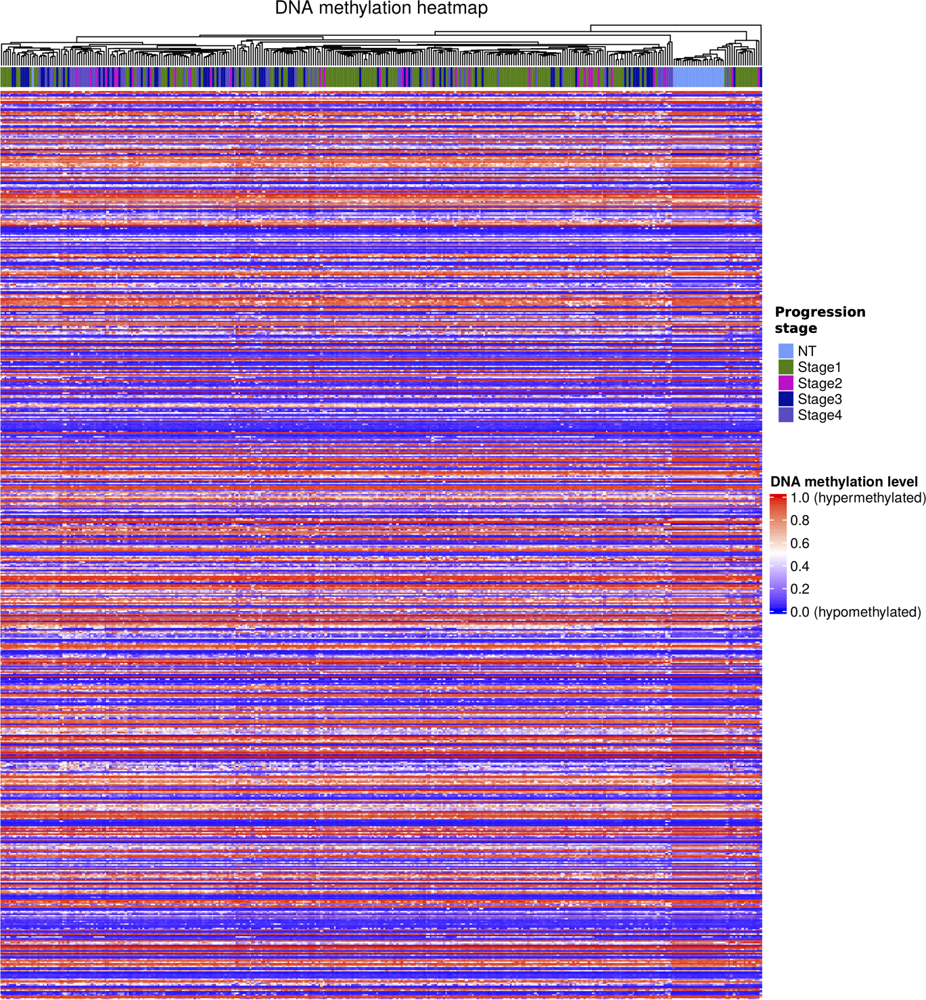

### Sitios CpGs diferencialmente metilados
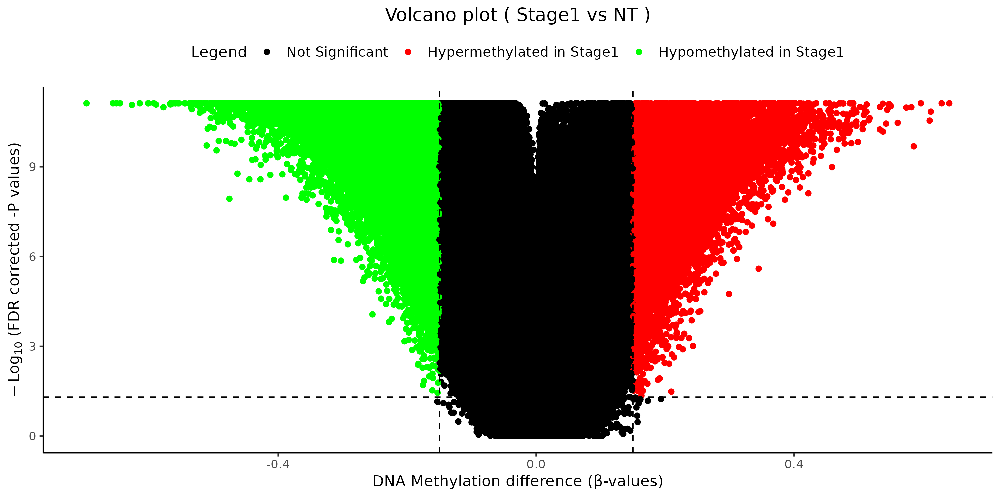

### Algoritmo de metilación diferencial

### Ejemplo: Gen Hipermetilado (ERMP1) 
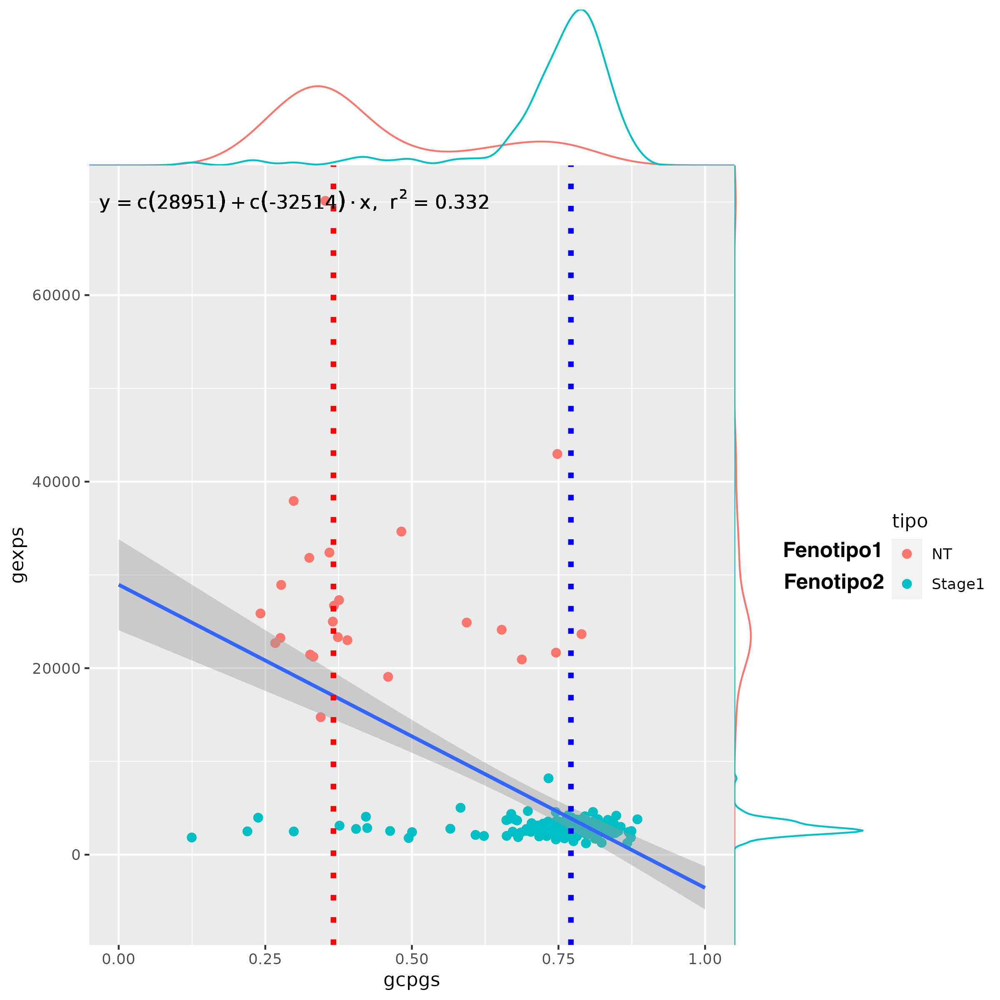

### Ejemplo: Gen Hipometilado (IL32)
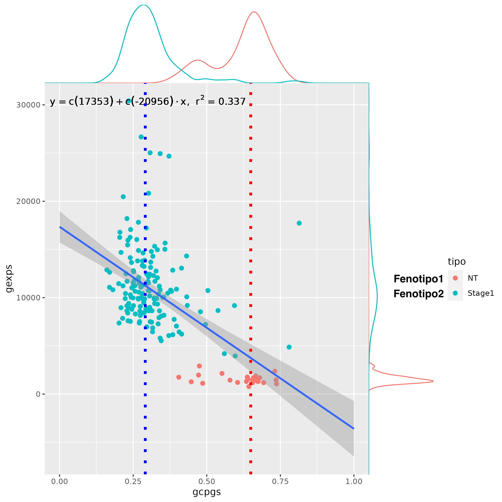

### Genes afectados por la metilación

### Criterio funcional (Hipometilados)
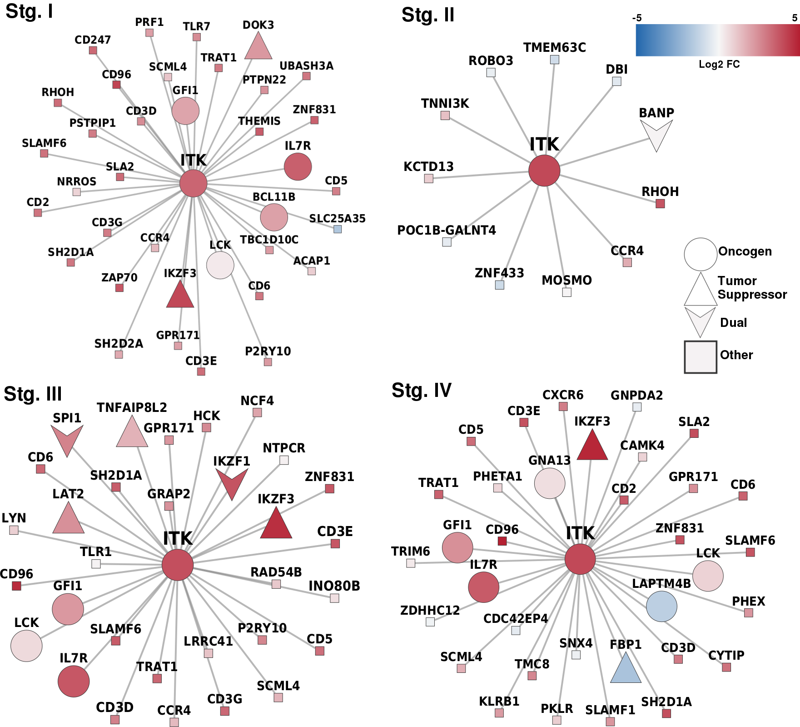

### Criterio funcional (Hipermetilados)
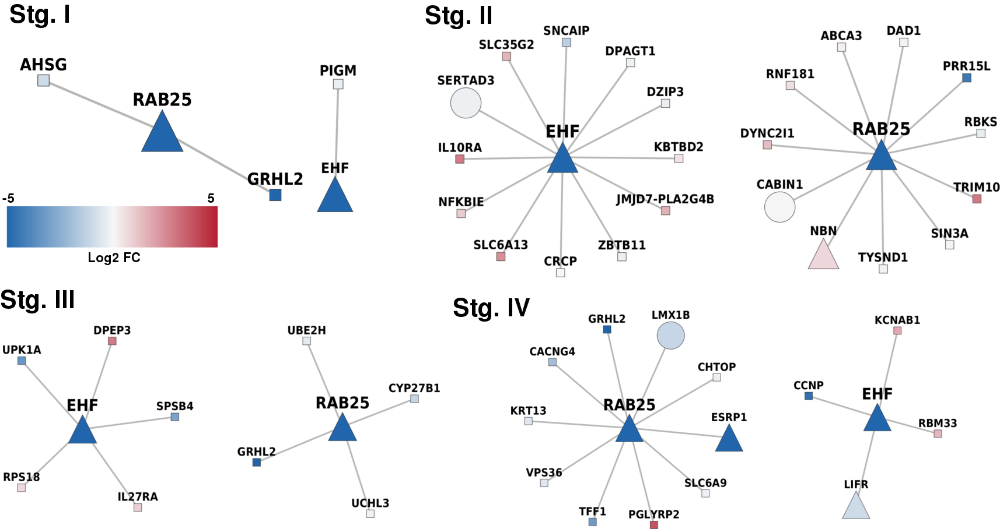

### Enriquecimiento funcional de las 4 etapas
| Metilación    | Gene núcleo   | Función Biológica  |
|:------------- |:-------------:| -----:|
|  hypo         | ITK           | Activación de células T |
|  hyper        | RAB25         |   Supresor tumoral      |

### RAB25: Funciones en cáncer
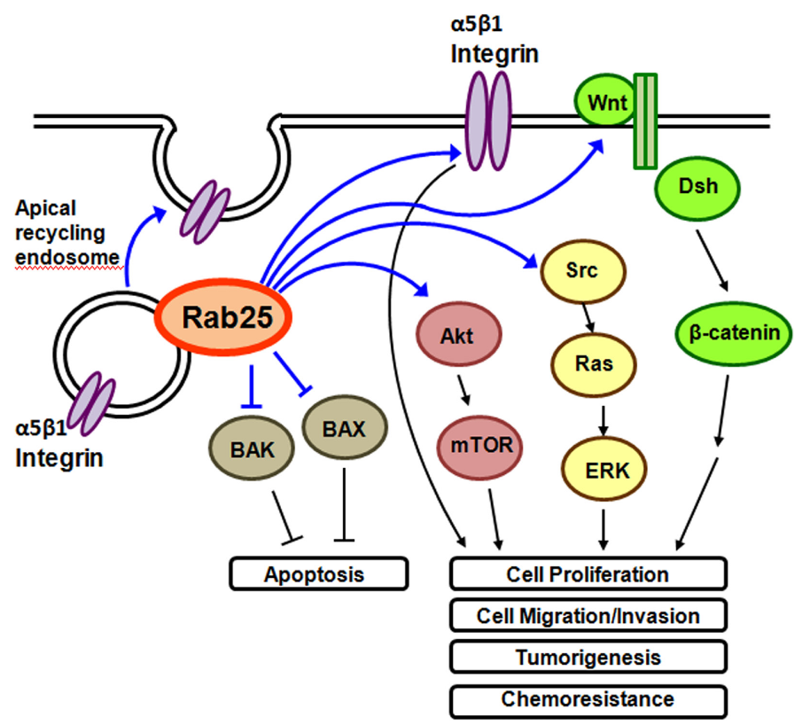

<a target="_blank" href="">[1]</a>Wang S, et al. Rab25 GTPase: Functional roles in cancer. Oncotarget. 2017;8(38):64591-64599

### Infiltración
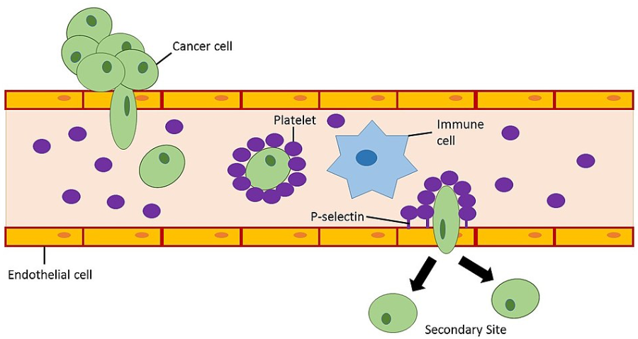

### Implicaciones
- La metilacion puede apagar un supresor tumoral (RAB25) en las etapas del cancer
- En las 4 etapas puede haber inflitracion de celulas del sistema inmune que cambiaron su patron de metilacion en ciertos genes importantes (ITK) en sus desarrollo.
- Esta metodologia puede reproducir los 

### Trabajo futuro
- Usar esta metodología para evaluar los siguientes tejidos de cáncer.
- Escribir la tesis doctoral.

### Agradecimientos
- Comité tutoral.
- Comité del exámen de candidatura.
- CONACYT (cvu 267236).
- UNAM, IE e INMEGEN.

### Resultados académicos

**1--**  Curso de Biología Molecular (Dr. Felix Recillas)
**2--**  Exámen de Candidatura
**4--**  *Zamora-Fuentes JM*, Hernández-Lemus E, Espinal-Enríquez J. **methylation-driven gene networks in Clear Cell Renal Carcinoma** (*Enviado*).  
**4--**  *Zamora-Fuentes JM*, Hernández-Lemus E, Espinal-Enríquez J. **miR-217 regulates different oncogenes during clear cell renal carcinoma progression** (*En revisión, Frontiers in Oncology*).  
**5--** *Zamora-Fuentes JM*, Hernández-Lemus E, Espinal-Enríquez J. **Gene Expression and Co-expression Networks Are Strongly Altered Through Stages in Clear Cell Renal Carcinoma.** Front Genet. 2020;11:578679. Published 2020 Nov 3.  
**6--**  González-Espinoza A, *Zamora-Fuentes JM*, Hernández-Lemus E, Espinal-Enríquez J. **Gene Co-Expression in Breast Cancer: A Matter of Distance.** Front Oncol. 2021;11:726493. Published 2021 Nov 17.  
**7--**  Andonegui-Elguera SD, *Zamora-Fuentes JM*, Espinal-Enríquez J, Hernández-Lemus E. **Loss of Long Distance Co-Expression in Lung Cancer.** Front Genet. 2021;12:625741. Published 2021 Mar 10.  

### Apendice

### Microambiente

<a target="_blank" href="">[1]</a>Yoshihara K, Inferring tumour purity and stromal and immune cell admixture from expression data. Nat Commun. 2013;4(1):2612.

### ccRC - CNVS (Amplificaciones)

### Mutaciones en ccRC

### Cáncer en México
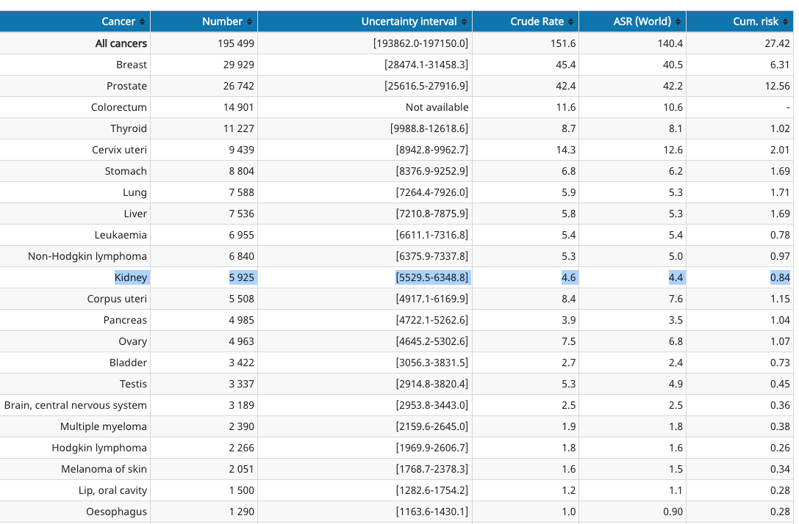

<a target="_blank" href="">Globocan  </a>https://gco.iarc.fr/today

### Aumento de Cáncer de riñon en hombres

